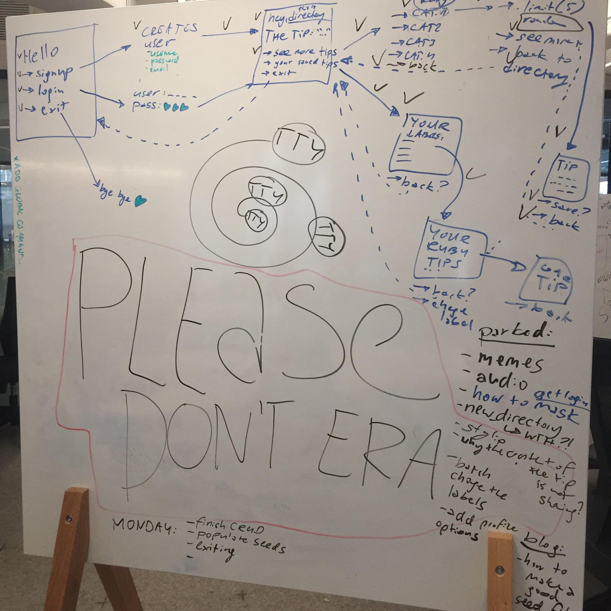

# Ruby CLI stub repo

### NOTE
- this setup contains a rakefile with helpful process reminders

## Table of Contents
- [Getting Started](#getting-started)
    - [Setup](#setup)
    - [Coding](#coding)
- [Github Workflow Primer](#github-workflow-primer)
- [Tools](#tools)
    - [Fun Gems](#fun-gems)
    - [Other tty gems](#other-tty-gems)
    - [List of APIs](#apis)
    - [Tutorials](#tutorials)
    - [Other tools](#other-tools)

--- 

## Getting started

After you have drawn your ERD and decided on the user stories, follow these steps.

### Setup
0. Fork and clone the repo, `cd` to the folder and then run `rm -rf .git` to remove git tracking. This will allow you to use this repo as your own repository, unconnected to mine. Go to github, create a new repository and upload the starter there. 
1. Create/update the info in the Gemfile + run `bundle`
2. Create migrations: run `rake db:create_migration` and add the syntax you need (e.g. `NAME=create_users`)
3. Migrate: run `rake db:migrate`
* **REMEMBER** never ever ever change anything manually in the schema.
4. Go to `.bin/run.rb` and change the name of the app on line 3 AND/OR go to `Rakefile` and change the name of the app on line 15
5. Go to `./app/models` and change the names of the files (e.g. `User.rb` <- singular) and the class names inside
6. Set up association macros in classes (`belongs_to` / `has_many` / `has_many, through:`)
7. Create seed file in `db/seed.rb` + then run `rake db:seed`
* remember: seeding does not give you any output so no news on your console == good news
8. Check if you've seeded correctly: run `rake console` and check the last instance of any of your class 
9. Go to `./app/yourAppName.rb` and change that file's name and whatever is inside (the class name should correspond to what you wrote in `.bin/run.rb` on line 3)
10. Go to `./Rakefile` and change nameOfYourApp there as well (save the file!); 
11. Now you can start your app either by running `rake start` in your terminal OR by running `ruby ./bin/run.rb`. You can delete the rake task or the `run.rb` if you have a preference. You can also change the rake task name, or even -- more advanced and not necessarily the best use of your time -- create an alias that would start your app
12. Remember to change the readme at the end. If you need an inspiration on how to write a good readme, check [this blog post](https://dev.to/sylwiavargas/recipe-for-a-good-readme-3m6j).

### Coding
1. Create a dummy version of your logic -> hardcode it and don't yet make your code save anything to the database, just make sure that the logic works
2. Test often by running the file, by running `rake console` or by `binding.pry`
3. What I fould useful is drawing out every step I want to guide users through before coding - my whiteboard looked like this:

4. I first coded the dummy version (without saving to the database, just to see if all "if"s are working and all that jazz)
5. Then I added the database methods.
6. Then only I beautified the code and the app to make it visually pleasing

---

## Github workflow primer
I thought I’d share the git workflow my tech collective follows:
1. Add everyone as a collaborator to the repo
2. clone the repo; in the repo, have two standard branches: `main` and `dev`;
3. before a coding session (each time), first run `git pull origin main`, then `git checkout -b nameOfTheFeature-yourName`; every now and then, once you’re done with some deliverable, add/commit/push the code to that new branch;
   - ALWAYS WRITE DESCRIPTIVE COMMIT MESSAGES, it is extremely important for the future employer -- here's [a guide to what makes a good commit message](https://www.freecodecamp.org/news/writing-good-commit-messages-a-practical-guide/)
4. once the feature is “done” and you checked whether it’s not bugging out, merge it to `dev`:
    - add/commit/push your code to your feature branch
    - then change the branch to dev: `git checkout dev`
    - then merge: `git merge nameOfTheFeature-yourName`
    - then test all your code (in rake console test the associations, in CLI test the workflow)
    - fix bugs, add/commit/push
5. once it’s on the `dev`, your partner checks your code and if it’s okay, they merge it to `main`;
**SO:**
- `main branch`: ONLY push to this branch if the feature is working + reviewed by both partners
- `dev branch`: code that works + is up for review (it’s like a pull request)
- `feature branch`: always created from the last version of the `dev branch`, contains code in progress

PLEASE DO USE MULTIPLE BRANCHES AND NOT ONLY ONE to minimize the risk of overwriting your working code with an accidental commit. Traveling in time with git is possible but it’s not the most pleasurable thing to do with your day.

For project management, we use [git projects](https://github.com/features/project-management/) (instead of trello or asana) and git issues. We do stand ups and stand downs every day, where we distribute tasks and give summaries of what has been done. We pair program whenever possible, stair each pairing with discussing ground rules and end with giving each other feedback. However, given the fact that we all have full-time jobs it is not always the case. 

---

## Tools

I collected tools for your app that might be helpful.

###  Fun Gems
- `tty-prompt` - nice interface for prompting for user input -- [see here how to set it up](https://github.com/sylwiavargas/tty-prompt-activity)
- `rest-client` - make HTTP requests and get data from APIs
- `faker` - randomly generated seed data fun
- `colorize` - colored text output in your terminal
- `lolcat` - enabling rainbow text coloring
- `formatador` - styling output information into a neat table
- `artii` - creating text banners

### Other tty gems
- [tty-box](https://github.com/piotrmurach/tty-box) -- creating boxes in your terminal
- [tty-progressbar](https://github.com/piotrmurach/tty-progressbar) -- flexible progress bar drawing in terminal emulators
- [tty-tree](https://github.com/piotrmurach/tty-tree) -- if you want to represent e.g. file structure
- [tty-reader](https://github.com/piotrmurach/tty-reader) -- allows you to trigger some events on specific keys
- [tty-markdown](https://github.com/piotrmurach/tty-markdown-cli) -- formatting tools for long texts

### APIs
- [APIs](https://rapidapi.com/collection/cool-apis)
- [And more APIs](https://medium.com/@vicbergquist/18-fun-apis-for-your-next-project-8008841c7be9)

### Tutorials
- [Adding animations to your CLI by Sylwia Vargas](https://medium.com/better-programming/add-an-animation-or-a-giph-to-your-ruby-cli-29952e8c46ea)
- [Adding ASCII Art to your CLI by Sylwia Vargas](https://medium.com/@sylwiavargas/adding-pictures-to-your-ruby-cli-4252b89823a)
- [Lecture: Setting up TTY Prompt in your CLI by Sylwia Vargas](https://github.com/sylwiavargas/tty-prompt-activity)
- [Sending SMS with Twilio API in your CLI by Danny Sasse](https://dsasse07.medium.com/sending-sms-text-from-a-ruby-app-f8222c30e986)
- [Refactoring your app into modules by Danny Sasse](https://dsasse07.medium.com/refactoring-app-features-into-modules-in-ruby-fa5fd11dec61)
- [Introducing music to your CLI](https://simplemitch.com/2020/02/20/afplay-definitive-guide-to-manipulating-audio-in-your-cli-application-ruby/)
- [Streamlining git add/commit/push by Shane Lonergan](https://medium.com/swlh/creating-new-bash-commands-and-aliases-c9272fd589c4)
- [Good git primer by Isabel K. Lee](https://dev.to/isabelxklee/a-beginner-s-guide-to-git-github-41jc)
- [A git cheat-sheet](https://education.github.com/git-cheat-sheet-education.pdf)
- [Project tracking tool from GitHub (where you can connect projects, issues, etc) by Isabel K. Lee:](https://medium.com/swlh/how-git-and-github-can-make-your-life-easier-2ff5b9e1f6f1)

### Other tools
- [Terminal recording](https://asciinema.org/) for your readme
- [Github projects](https://github.com/features/project-management/) for better project management
